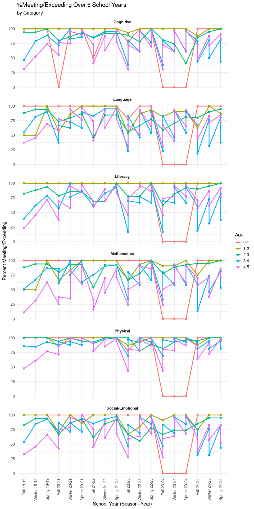
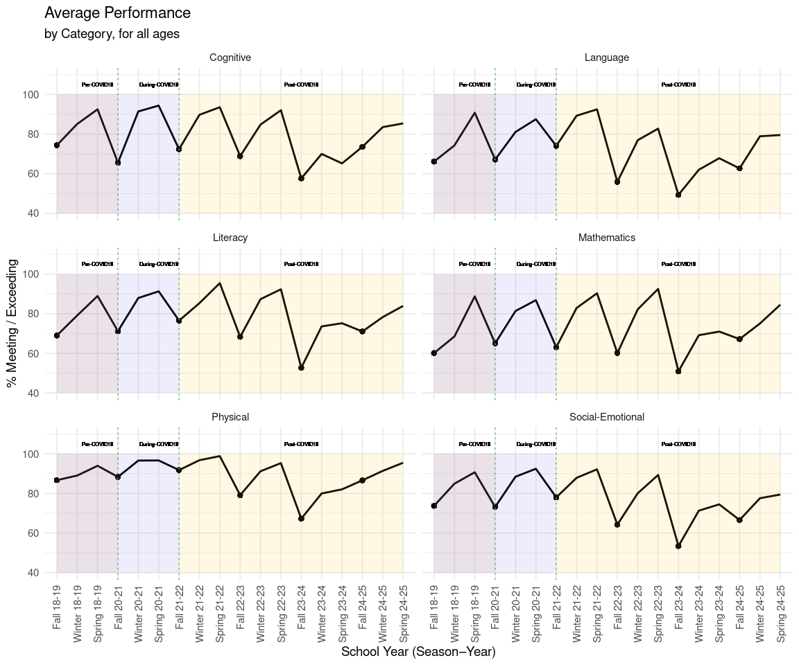
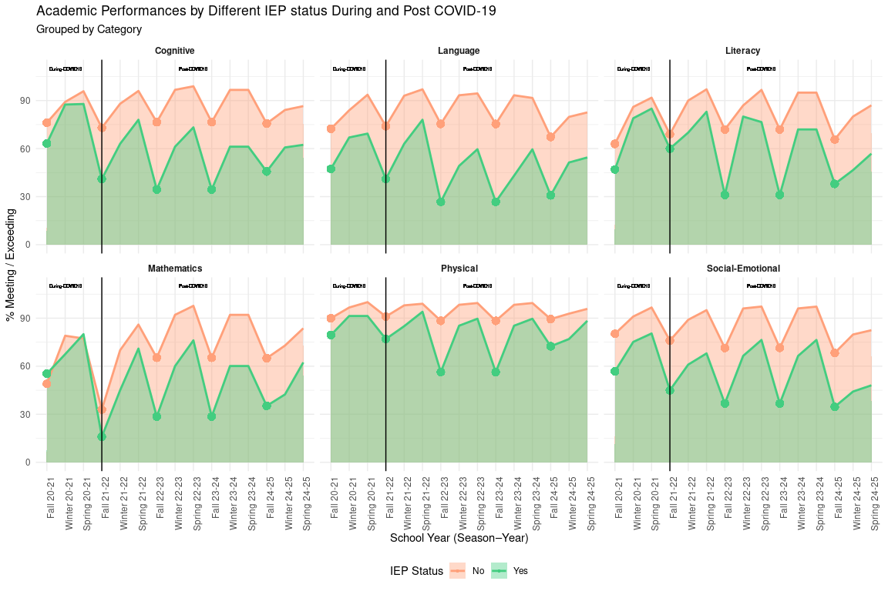
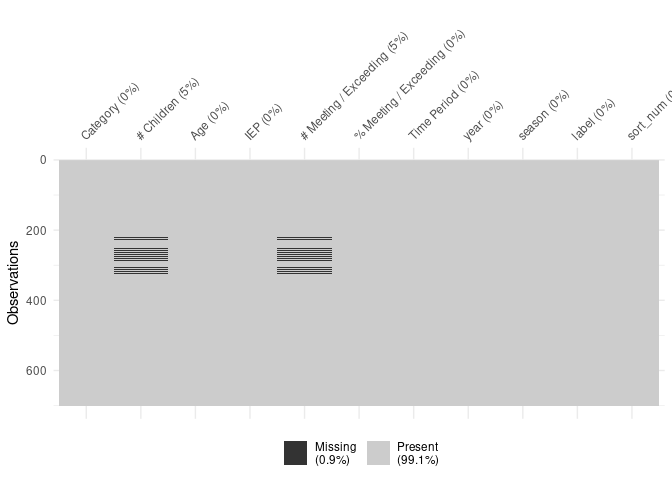
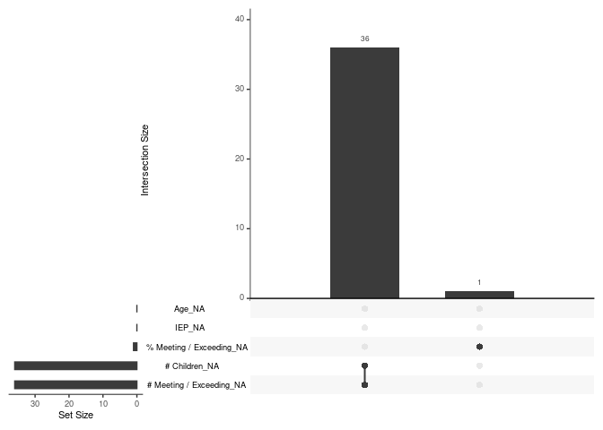

Project memo
================
Gold Analysts - Mekkawy, Nisan, Razvan

``` r
library(tidyverse)
library(broom)
library(readxl)
library(dplyr)
library(skimr)
library(naniar)
```

``` r
X2018_2019 <- read_excel("../data/ignore/2018-2019.xlsx")
X2020_2021 <- read_excel("../data/ignore/2020-2021.xlsx")
X2021_2022 <- read_excel("../data/ignore/2021-2022.xlsx")
X2022_2023 <- read_excel("../data/ignore/2022-2023.xlsx")
X2023_2024 <- read_excel("../data/ignore/2023-2024.xlsx")
X2024_2025 <- read_excel("../data/ignore/2024-2025.xlsx")
```

## Data Clean Up Steps for Overall Data

### Step 1: Convert chars into numbers

For each year we need to first convert our number of children, number of
meeting/exceeding, and percentage of meeting/exceeding in numeric values
and create a year column that would help us with sorting and labeling

``` r
general_data_table <- bind_rows(
  X2018_2019 |>
    mutate(
      `# Children` = parse_number(as.character(`# Children`), na = c("N/A", "NA")), 
      `# Meeting / Exceeding` = parse_number(as.character(`# Meeting / Exceeding`), na = c("N/A", "NA")), 
      `% Meeting / Exceeding` = parse_number(as.character(`% Meeting / Exceeding`)), 
      year = "18-19"), 
  X2020_2021 |>
    mutate(
      `# Children` = parse_number(as.character(`# Children`), na = c("N/A", "NA")), 
      `# Meeting / Exceeding` = parse_number(as.character(`# Meeting / Exceeding`), na = c("N/A", "NA")), 
      `% Meeting / Exceeding` = parse_number(as.character(`% Meeting / Exceeding`)), 
      year = "20-21"), 
  X2021_2022|>
    mutate(
      `# Children` = parse_number(as.character(`# Children`), na = c("N/A", "NA")), 
      `# Meeting / Exceeding` = parse_number(as.character(`# Meeting / Exceeding`), na = c("N/A", "NA")), 
      `% Meeting / Exceeding` = parse_number(as.character(`% Meeting / Exceeding`)), 
      year = "21-22"), 
  X2022_2023|>
    mutate(
      `# Children` = parse_number(as.character(`# Children`), na = c("N/A", "NA")), 
      `# Meeting / Exceeding` = parse_number(as.character(`# Meeting / Exceeding`), na = c("N/A", "NA")), 
      `% Meeting / Exceeding` = parse_number(as.character(`% Meeting / Exceeding`)), 
      year = "22-23"), 
  X2023_2024|>
    mutate(
      `# Children` = parse_number(as.character(`# Children`), na = c("N/A", "NA")), 
      `# Meeting / Exceeding` = parse_number(as.character(`# Meeting / Exceeding`), na = c("N/A", "NA")), 
      `% Meeting / Exceeding` = parse_number(as.character(`% Meeting / Exceeding`), na = c("N/A", "NA", "#DIV/0!")), 
      year = "23-24"), 
  X2024_2025|>
    mutate(
      `# Children` = parse_number(as.character(`# Children`), na = c("N/A", "NA")), 
      `# Meeting / Exceeding` = parse_number(as.character(`# Meeting / Exceeding`), na = c("N/A", "NA")), 
      `% Meeting / Exceeding` = parse_number(as.character(`% Meeting / Exceeding`)), 
      year = "24-25")
  )
```

### Step 2: Redo labels

Shortening and simplifying the label for each school year and trimester.
Assigning a code for each label so it is easier to reorder
chronologically: (Fall - 1, Winter - 2, Spring - 3) e.g. Fall 2018-2019
-\> 181, Winter 2021-2022 -\> 212

``` r
general_data_table <- general_data_table |>
  mutate(
    season = case_when(
      str_detect(`Time Period`, "Fall") ~ "Fall",
      str_detect(`Time Period`, "Winter") ~ "Winter",
      str_detect(`Time Period`, "Spring") ~ "Spring"
    ),
    label = paste(season, year),
    sort_num = as.numeric(str_sub(year, 1, 2)) * 10 + match(season,c("Fall","Winter","Spring")))
```

### Step 3: Order data chronologically

``` r
general_data_table <- general_data_table |>
  mutate(
    label = fct_reorder(label, sort_num)
  )
```

## Plots

### Plot 1: Average performance

#### First General Data Attempt

``` r
suppressWarnings(
general_data_plot <- ggplot(general_data_table, aes(x = label, y = `% Meeting / Exceeding`, color = Age, group = Age)) +
  geom_line(size = 1.1) +
  geom_point(size = 2) +
  facet_wrap(~ Category, ncol = 1) +
  ylim(0, 100)+
  labs(
    title = "%Meeting/Exceeding Over 6 School Years",
    subtitle = "by Category",
    x = "School Year (Season–Year)",
    y = "Percent Meeting/Exceeding"
  ) +
  theme_minimal(base_size = 14) +
  theme(
    axis.text.x = element_text(angle = 90, hjust = 1, vjust = 0.5),
    strip.text = element_text(face = "bold"),
    panel.spacing = unit(1, "lines")
  )
)

general_data_plot
```

<!-- -->

#### Cleaning data for the Average Plot

Creating a new column that would help us highlight the beginning of the
school year.

``` r
average_general_data_table <- general_data_table |>
  mutate(is_fall = (`season` == "Fall"))
```

Calculating the average of all age groups’ seasonal performance.

``` r
average_general_data_table <- average_general_data_table |>
  group_by(Category, label, sort_num, is_fall) |>
  summarise(
    `Avg Meeting Exceeding` = mean(`% Meeting / Exceeding`, na.rm = TRUE),
    .groups = "drop"
  )
```

#### Final Plot 1

``` r
average_general_data_plot <- ggplot(average_general_data_table, aes(x = label, y = `Avg Meeting Exceeding`, group = Category)) +
  geom_line(size = 1) +
  geom_point(aes(size = ifelse(is_fall, 4, NA)), shape = 20, stroke = 0) +
  geom_vline(xintercept = "Fall 20-21", linetype = "dotted", color = "#51C168")+
  geom_vline(xintercept = "Fall 21-22", linetype = "dotted", color = "#51C168")+
  annotate("rect", xmin="Fall 18-19", xmax="Fall 20-21", ymin = 40, ymax = 100, alpha = 0.1, fill = "#E7913E")+
  annotate("rect", xmin="Fall 18-19", xmax="Fall 21-22", ymin = 40, ymax = 100, alpha = 0.1, fill = "#5C57D8")+
  annotate("rect", xmin="Fall 21-22", xmax="Spring 24-25", ymin = 40, ymax = 100, alpha = 0.1, fill = "#FABA09")+
  geom_text( 
    aes(x = "Spring 18-19", y = 105, label = "Pre-COVID19"),
    size = 2) +
  geom_text( 
    aes(x = "Spring 20-21", y = 105, label = "During-COVID19"),
    size = 2) +
  geom_text( 
    aes(x = "Fall 23-24", y = 105, label = "Post-COVID19"),
    size = 2) +
  facet_wrap(~ Category, ncol = 2) +
  ylim(40, 110)+
  labs(
    title = "Average Performance",
    subtitle = "by Category, for all ages",
    x = "School Year (Season–Year)",
    y = "% Meeting / Exceeding"
  ) +
  theme_minimal(base_size = 14) +
  theme(
    axis.text.x = element_text(angle = 90, hjust = 1, vjust = 0.5),
    legend.position = "none"
  )

average_general_data_plot
```

    ## Warning: Removed 72 rows containing missing values or values outside the scale range
    ## (`geom_point()`).



``` r
#saving
ggsave("average_general_plot.png", average_general_data_plot, width = 15, height = 10, dpi = 300)
```

    ## Warning: Removed 72 rows containing missing values or values outside the scale range
    ## (`geom_point()`).

Average percentage of children meeting/exceeding expectations for all
the age groups the NGO works with.

After the COVID-19 pandemic, less and less children tend to perform well
when compared with the previous years. Less children perform well from
the first trimester, and the growth over the school year seems to be
more and more linear instead of steep.

To get more insights, we focused on two main variables: age groups and
IEP status.

### Plot 2: IEP

Before creating the IEP graph, we first built a cleaned dataset called
IEP_data from general_data_table. We used mutate(IEP = na_if(IEP,
“N/A”)) to turn “N/A” values in the IEP column into missing values, and
then removed those rows with filter(!is.na(IEP)) so that only children
with a recorded IEP status were kept. Next, we added a new variable
is_fall that is TRUE when the trimester/season is “Fall” and FALSE
otherwise; this lets us highlight fall points in the graph. Finally, we
grouped the data by category, trimester label, sorting number, is_fall,
and IEP status, and calculated the mean % Meeting / Exceeding in each
group. We stored this as Avg IEP Meeting Exceeding, which is the summary
measure used in the IEP graph.

``` r
all_year <- general_data_table |>
  mutate(IEP = na_if(IEP, "N/A")) |>
  filter(!is.na(IEP))

IEP_data <- all_year |>
  mutate(is_fall = (`season` == "Fall"))

IEP_data <- IEP_data |>
  group_by(Category, label, sort_num, is_fall, IEP) |>
  summarise(
    `Avg IEP Meeting Exceeding` = mean(`% Meeting / Exceeding`, na.rm = TRUE),
    .groups = "drop"
  )
```

After creating the IEP dataset, we produced our first IEP graph using a
line plot to show the trend of the two IEP statuses during and after the
COVID-19 pandemic (our dataset did not include IEP data for the
pre-COVID years). Similar to our previous graphs, we placed a point at
each Fall semester to indicate the start of the school year.

``` r
iep_graph <- ggplot(
  IEP_data,
  aes(x = `label`, y = `Avg IEP Meeting Exceeding`, fill = IEP, group = IEP)
) +
  geom_line(aes(color = IEP), size = 1) +
  geom_point(aes(size = ifelse(is_fall, 4, NA)), shape = 21 , stroke = 0) +
  facet_wrap(~ Category) +
  labs(
    title = "Academic Performances by Different IEP status During and Post COVID-19",
    x = "School Year (Season–Year)",
    y = "% Meeting / Exceeding",
    subtitle = "Grouped by Category ",
    fill = "IEP Status",
    color = "IEP Status"
  ) +
  theme_minimal() +
  theme(
    axis.text.x = element_text(angle = 90, hjust = 1),
    legend.position = "bottom",
    strip.text = element_text(face = "bold")
  )

iep_graph
```

    ## Warning: Removed 120 rows containing missing values or values outside the scale range
    ## (`geom_point()`).

<!-- -->

``` r
ggsave("iep_impact.png", iep_graph, width = 15, height = 10, dpi = 300)
```

    ## Warning: Removed 120 rows containing missing values or values outside the scale range
    ## (`geom_point()`).

Later, to better visualize the difference between the two groups, we
decided to use geom_area(). We also added a vertical line separating the
during-COVID and post-COVID periods, with labels on both sides to
highlight the transition and emphasize the pandemic’s impact in the
following years. Finally, we adjusted the color scheme of the graph so
that it aligns with the rest of the plots in our handout.

``` r
iep_graph <- ggplot(
  IEP_data,
  aes(x = `label`, y = `Avg IEP Meeting Exceeding`, fill = IEP, group = IEP)
) +
  geom_area(position = "identity", alpha = 0.4) +
  geom_line(aes(color = IEP), size = 1) +
  geom_point(aes(size = ifelse(is_fall, 4, NA)), shape = 21 , stroke = 0) +
  geom_vline(xintercept = "Fall 21-22") +
  geom_text( 
    aes(x = "Spring 22-23", y = 110, label = "Post-COVID19"),
    size = 1.5) +
  geom_text( 
    aes(x = "Winter 20-21", y = 110, label = "During-COVID19"),
    size = 1.5) +
  facet_wrap(~ Category) +
  labs(
    title = "Academic Performances by Different IEP status During and Post COVID-19",
    x = "School Year (Season–Year)",
    y = "% Meeting / Exceeding",
    subtitle = "Grouped by Category ",
    fill = "IEP Status",
    color = "IEP Status"
  ) +
  scale_size_identity(guide = "none") +
  scale_color_manual(
    values = c(
      "No" = "lightsalmon", 
      "Yes" = "seagreen3"
    ) 
  ) +
  scale_fill_manual(
     values = c(
      "No" = "lightsalmon", 
      "Yes" = "seagreen3"
    ) 
  ) +
  theme_minimal() +
  theme(
    axis.text.x = element_text(angle = 90, hjust = 1),
    legend.position = "bottom",
    strip.text = element_text(face = "bold")
  )

iep_graph
```

    ## Warning: Removed 120 rows containing missing values or values outside the scale range
    ## (`geom_point()`).

<!-- -->

``` r
ggsave("iep_impact.png", iep_graph, width = 15, height = 10, dpi = 300)
```

    ## Warning: Removed 120 rows containing missing values or values outside the scale range
    ## (`geom_point()`).

During the COVID-19 period, although overall performance was lower, the
gap between students with IEP status and those without IEP status was
relatively small across most categories, including Cognitive,
Mathematics, Literacy, and Physical. After the pandemic, this gap
widened. Students with IEP status showed larger decreases in Language,
Cognitive, and Mathematics performance, while the Physical category
remained more stable. Even four years after the pandemic, the
performance gap between IEP and non-IEP students remains larger than it
was during COVID-19. Overall, this graph suggests that children with IEP
status were more affected by the pandemic and have not yet fully
recovered.

### Plot 3: Age Grouped Plot

Our goal here is to create a chart that shows the percentage of children
meeting learning goals in six areas: Cognitive, Language, Literacy,
Math, Physical, and Social-Emotional. The chart will use data from the
2018–2019 to the 2024–2025 school years and will show progress each Fall
(F), Winter (W), and Spring (S). Each line will represent an age group
ande the purpose is to show how COVID-19 affected children’s learning
and how their development has changed and improved over time.

In the first part, we take the data from each school year and combine it
into one dataset. For every year we select only the columns we need,
change the values into proper numeric form and add a label to show which
school year each row belongs to. We also include alternative text to
help make our final plot more accessible for all users. By the end of
this step, all six years of data are merged into one clean table that is
ready for analysis.

``` r
# 1. Combine all school-year data, convert to numeric, and tag with year
data <- bind_rows(
  X2018_2019 |> select(Category, `# Children`, Age, `# Meeting / Exceeding`, `Time Period`) |> 
    mutate(`# Children` = suppressWarnings(as.numeric(`# Children`)), 
           `# Meeting / Exceeding` = suppressWarnings(as.numeric(`# Meeting / Exceeding`)), 
           year = "18-19"),
  X2020_2021 |> select(Category, `# Children`, Age, `# Meeting / Exceeding`, `Time Period`) |> 
    mutate(`# Children` = suppressWarnings(as.numeric(`# Children`)), 
           `# Meeting / Exceeding` = suppressWarnings(as.numeric(`# Meeting / Exceeding`)), 
           year = "20-21"), 
  X2021_2022 |> select(Category, `# Children`, Age, `# Meeting / Exceeding`, `Time Period`) |> 
    mutate(`# Children` = suppressWarnings(as.numeric(`# Children`)), 
           `# Meeting / Exceeding` = suppressWarnings(as.numeric(`# Meeting / Exceeding`)), 
           year = "21-22"),
  X2022_2023 |> select(Category, `# Children`, Age, `# Meeting / Exceeding`, `Time Period`) |> 
    mutate(`# Children` = suppressWarnings(as.numeric(`# Children`)), 
           `# Meeting / Exceeding` = suppressWarnings(as.numeric(`# Meeting / Exceeding`)), 
           year = "22-23"),
  X2023_2024 |> select(Category, `# Children`, Age, `# Meeting / Exceeding`, `Time Period`) |> 
    mutate(`# Children` = suppressWarnings(as.numeric(`# Children`)), 
           `# Meeting / Exceeding` = suppressWarnings(as.numeric(`# Meeting / Exceeding`)), 
           year = "23-24"),
  X2024_2025 |> select(Category, `# Children`, Age, `# Meeting / Exceeding`, `Time Period`) |> 
    mutate(`# Children` = suppressWarnings(as.numeric(`# Children`)), 
           `# Meeting / Exceeding` = suppressWarnings(as.numeric(`# Meeting / Exceeding`)), 
           year = "24-25")
)
```

In the second part, we get the data ready for graphing. We create short
labels to show the season Fall (F), Winter (W), or Spring (S) and we
combine each season with its year to make a clear timeline label. We
also make a sorting number so the seasons stay in the correct order on
the chart. Then we calculate the percentage of children meeting learning
goals in each group. Finally we filter the very young age groups (0–1
and 1–2) as the chart will only focus on ages 2–3, 3–4, and 4–5.

``` r
# 2. Add season labels, create ordered labels, compute percent, filter ages
data <- data |>
mutate(
season = case_when(
str_detect(`Time Period`, "Fall") ~ "F",
str_detect(`Time Period`, "Winter") ~ "W",
str_detect(`Time Period`, "Spring") ~ "S"
    ),
label = paste0(season, year),
sort_num = as.numeric(str_sub(year, 1, 2)) * 10 + match(season, c("F","W","S"))
  ) |>
drop_na() |>
group_by(label, Category, Age, sort_num, year, season) |>
summarise(percent = sum(`# Meeting / Exceeding`) / sum(`# Children`) * 100, .groups = "drop")

data <- data |>
filter(Age != "0-1") |>
drop_na()

data <- data |>
filter(Age != "1-2") |>
drop_na() 
```

In the last part we create the visual chart. We draw lines showing how
each age group performed over time and we add a shaded green background
and a dashed line to highlight the period when COVID-19 started. Each
developmental category gets its own panel so the chart is easy to read.
After setting the colors and adjusting the labels and layout, we save
the final chart as a PNG image and display it. This gives us a clear
picture of how learning changed before, during and after the pandemic.

``` r
# I will make the plot and save it to covid_plot variable
covid_plot <- ggplot(data, aes(reorder(label, sort_num), percent, color = Age, group = Age)) +
# Add green background highlight for COVID period (Fall 2019 to Spring 2020)
annotate("rect", xmin = 3.5, xmax = 6.5, ymin = 0, ymax = 100, 
           fill = "#51C168", alpha = 0.1) +
## Add vertical green line at start of COVID
geom_vline(xintercept = 3.5, color = "#51C168", linetype = "dashed", size = 1) +
geom_line(size = 1.5, alpha = 0.8) +
geom_point(data = data |> group_by(Category, Age, year) |> filter(sort_num == min(sort_num)), 
    size = 2.5, alpha = 0.9) +
facet_wrap(~Category) +
scale_color_manual(values = c("#51C168", "#5C57D8", "#FABA09")) +
ylim(0, 100) +
labs(title = "COVID-19 Impact on Age Groups", 
x = "School Year (Season–Year)", 
y = "% Meeting / Exceeding") +
theme_minimal() +
theme(
axis.text.x = element_text(angle = 90, size = 9),
strip.text = element_text(face = "bold"),
legend.position = "bottom",
plot.caption = element_text(hjust = 0, color = "#51C168", face = "italic")
  )

#Save Png
ggsave("covid_clear_plot.png", covid_plot, width = 20, height = 12, dpi = 300)
covid_plot
```

<!-- -->

Our age group plot here examines how children of different age groups
were impacted by COVID-19 across six developmental categories. It tracks
their trajectory from pre-pandemic baselines through the recovery
period. During the pandemic, performance became notably unstable , with
the youngest group (ages 2–3) often maintaining higher scores while the
older groups (3–5 years) struggled to maintain consistency. After the
initial lockdown period, we observed specific declines, most notably a
delayed drop for the 2–3 year olds in Social-Emotional and Language
skills around 2021, though the gap between age groups in areas like
Mathematics and Cognitive development often widened with the oldest
children trailing behind. Even four years after the height of the
pandemic, these performance stratifications persist, showing that the
2–3 year olds have largely rebounded to become the highest-performing
group while the 4–5 year olds continue to lag. This shows that while
COVID-19 disrupted learning for everyone, the recovery has been
irregular with the oldest preschool cohort facing the most difficulty in
fully returning to pre-pandemic performance benchmarks.

### Plot 4: Missing Data

This plot is not included in our final hand-out, but we found it useful
in our planning process. It served as a useful indicator of our
limitations and it enabled us to adapt our visualizations based on the
information provided.

``` r
suppressWarnings(gg_miss_var(general_data_table))
```

<!-- -->

Thanks to this graph we can see that 99.1% of our data is complete,
validating our findings even more.

``` r
suppressWarnings(vis_miss(general_data_table))+
  theme(axis.text.x = element_text(vjust = 0))
```

<!-- -->

``` r
suppressWarnings(gg_miss_upset(general_data_table))
```

<!-- -->

Our only missing data is in the `# Children` and `# Meeting/Exceeding`
variables in the school year `2021-2022`. The NGO lost the specific
number of children they worked with for age group `4-5`, both with and
without an IEP status. However, we could still fully conduct our
research because they provided the exact percentage of children
meeting/exceeding in this category.

In conclusion, even though we found missing data, it did not impact our
study in any way.
