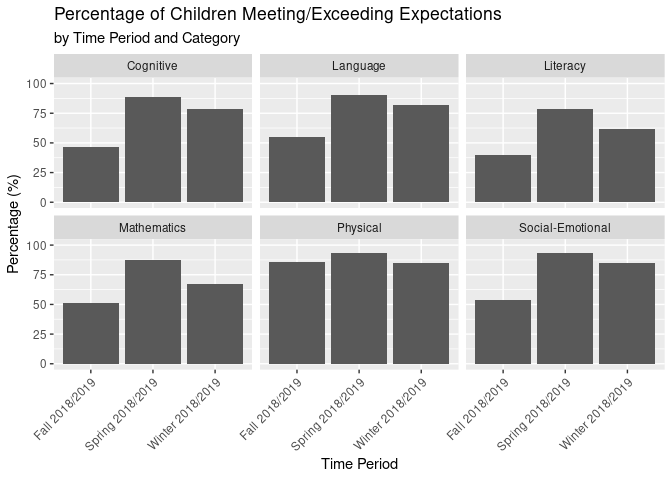
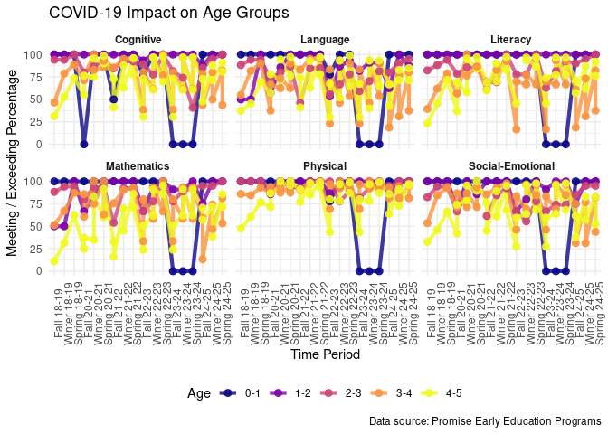

Project proposal
================
Gold Analysts - Mekkawy, Nissan, Razvan

``` r
library(tidyverse)
library(broom)
library(readxl)
library(dplyr)
library(skimr)
```

## 1. Intro

We are developing our research based on a database provided by Promise
Early Education Programs: Early Head Start and Head Start. They focus on
children’s developmental outcomes.

The data is collected using the Teaching Strategies Gold (TS GOLD)
assessment, which analyzes growth towards Widely Held Expectations (WHE)
for typically developing children at each stage.

This collection method categorizes children’s performance in every vital
classification: Physical Examination, Language, Cognitive,
Social-Emotional, Literacy and Mathematics.

We plan on researching how COVID-19 impacted different groups of
students. We will analyze these groups in two categories: based on their
age or based on whether they have an Individualized Educational Program
(IEP) or not.

The dataset used for this analysis contains 180 observations and 10
variables in the main structured table (prof_2018_2019). These variables
are `Category`, `WHE Bottom`, `WHE Top`, `# Children`, `Average`,
`# Below`, `% Below`, `# Meeting / Exceeding`, \`% Meeting / Exceeding
and Time Period.

For analysis. We did not analyze WHE Bottom, WHE Top, or Average, as we
used them only as benchmarks.

## 2. Data

We are currently tidying up the 6 datasets we plan on using for our
research. Each of them presents specific data collected in a school year
(e.g. 2018-2019, 2023-2024).

Meanwhile, since the datasets from the NGO have the same variables, we
will use a past dataset to explain the structure. Our variables are: -
`Bottom`: Lowest Score (for agency/ classroom) - `Top`: Highest Score
(for agency/ classroom - `# Children`: Total \# of children assessed -
`Average` : Average Score of children (for agency/ classroom) -
`# Below` :# of children below developmental expectations - `% Below` :
% of children below developmental expectations

``` r
prof_2018_2019 <- read_excel("../data/ignore/file_show.xlsx")
```

``` r
glimpse(prof_2018_2019)
```

    ## Rows: 180
    ## Columns: 10
    ## $ Category                <chr> "Social-Emotional", "Social-Emotional", "Socia…
    ## $ `WHE Bottom`            <dbl> 300, 300, 300, 300, 300, 300, 300, 300, 300, 3…
    ## $ `WHE Top`               <dbl> 396, 396, 396, 396, 396, 396, 396, 396, 396, 3…
    ## $ `# Children`            <dbl> 1, 7, 3, 11, 11, 8, 9, 9, 1, 11, 1, 7, 3, 11, …
    ## $ Average                 <dbl> 254, 302, 268, 347, 280, 299, 317, 373, 341, 2…
    ## $ `# Below`               <dbl> 1, 4, 3, 2, 8, 3, 1, 1, NA, 10, 1, 1, NA, NA, …
    ## $ `% Below`               <dbl> 100.0, 57.1, 100.0, 18.2, 72.7, 37.5, 11.1, 11…
    ## $ `# Meeting / Exceeding` <dbl> NA, 3, NA, 9, 3, 5, 8, 8, 1, 1, NA, 6, 3, 11, …
    ## $ `% Meeting / Exceeding` <dbl> 0.0, 42.9, 0.0, 81.8, 27.3, 62.5, 88.9, 88.9, …
    ## $ `Time Period`           <chr> "Fall 2018/2019", "Fall 2018/2019", "Fall 2018…

``` r
skim(prof_2018_2019)
```

|                                                  |                |
|:-------------------------------------------------|:---------------|
| Name                                             | prof_2018_2019 |
| Number of rows                                   | 180            |
| Number of columns                                | 10             |
| \_\_\_\_\_\_\_\_\_\_\_\_\_\_\_\_\_\_\_\_\_\_\_   |                |
| Column type frequency:                           |                |
| character                                        | 2              |
| numeric                                          | 8              |
| \_\_\_\_\_\_\_\_\_\_\_\_\_\_\_\_\_\_\_\_\_\_\_\_ |                |
| Group variables                                  | None           |

Data summary

**Variable type: character**

| skim_variable | n_missing | complete_rate | min | max | empty | n_unique | whitespace |
|:--------------|----------:|--------------:|----:|----:|------:|---------:|-----------:|
| Category      |         0 |             1 |   8 |  16 |     0 |        6 |          0 |
| Time Period   |         0 |             1 |  14 |  16 |     0 |        3 |          0 |

**Variable type: numeric**

| skim_variable | n_missing | complete_rate | mean | sd | p0 | p25 | p50 | p75 | p100 | hist |
|:---|---:|---:|---:|---:|---:|---:|---:|---:|---:|:---|
| WHE Bottom | 0 | 1.00 | 336.67 | 57.38 | 269.0 | 295.00 | 320.0 | 378.00 | 438 | ▇▁▂▂▂ |
| WHE Top | 0 | 1.00 | 476.67 | 77.18 | 390.0 | 396.00 | 461.5 | 555.00 | 596 | ▇▃▃▁▇ |
| \# Children | 0 | 1.00 | 7.08 | 3.80 | 1.0 | 3.00 | 8.5 | 11.00 | 11 | ▇▁▂▇▇ |
| Average | 0 | 1.00 | 395.13 | 102.52 | 213.0 | 314.75 | 380.0 | 453.00 | 738 | ▆▇▆▁▁ |
| \# Below | 72 | 0.60 | 3.14 | 2.70 | 1.0 | 1.00 | 2.0 | 4.00 | 11 | ▇▂▁▁▁ |
| % Below | 72 | 0.60 | 43.91 | 30.97 | 9.1 | 18.20 | 36.4 | 67.88 | 100 | ▇▅▁▃▃ |
| \# Meeting / Exceeding | 13 | 0.93 | 5.60 | 3.46 | 0.0 | 2.00 | 6.0 | 9.00 | 11 | ▇▅▂▅▇ |
| % Meeting / Exceeding | 0 | 1.00 | 73.66 | 32.23 | 0.0 | 57.10 | 88.9 | 100.00 | 100 | ▁▂▁▂▇ |

## 3. Data analysis plan

We will analyze our data from the following perspective: - Pre-COVID-19:
`2018_2019` - COVID-19: `2020_2021` and `2021_2022` - Post-COVID-19:
`2022_2023` , `2023_2024` and `2024_2025`

For our research questions, we will analyze the overall performance in
each general academic category: `Cognitive`, `Language`, `Literacy`,
`Mathematics`, `Physical`, and `Social-Emotional`.

For an in-depth categorization of our data, we will divide the data
based on `IEP` and `Age`.

To compare student success between these groups, we decided to create a
new variable representing the percentage of students who meet or exceed
expectations. We will analyze the data based on 3 timelines (Spring,
Winter, and Fall) within a school year.

#### Graphs:

1.  Ridgeline Density Plot - General: We aim to show how the pandemic
    affected students overall. To visualize this, we plan to use a
    density ridgeline graph, where the x-axis represents the Season +
    Year and the y-axis represents the percentage of children meeting or
    exceeding expectations. We also plan to separate the data by
    category using facets for clearer comparisons.

2.  Facet Line Graph - Age Groups: We will specifically focus on how the
    COVID-19 pandemic impacted different age groups, ranging from 0
    to 5. We plan to use a line graph, where the x-axis represents the
    Season + Year and the y-axis represents the percentage of students
    who meet or exceed expectations. The graph will be faceted by
    category, and different line colors will represent each age group.

3.  Facet Density Plot - IEP Groups: We will use similar axes (x =
    Season + Year, y = percentage of students who meet or exceed
    expectations) and the same facet categories as in our second graph.
    However, instead of focusing on different age groups, this graph
    will compare students with IEPs to those without IEPs to determine
    whether children with IEPs were more affected by the pandemic. For
    now, this graph will include data only up to Winter 2023, since we
    do not yet have IEP data for the 2023–2024 and 2024–2025 academic
    years. We are currently waiting for that information from Monica.

#### Preliminary exploratory data analysis

##### Pre-Covid Graph

With this graph, we aim to understand how successful Promise Early
Education was during a pre-COVID academic year (2018-2019) by comparing
the percentage of students who met or exceeded expectations across the
fall, winter, and spring assessments. The x-axis represents the Fall,
Winter, and Spring assessments for the 2018–2019 academic year, while
the y-axis shows the percentage of students who met or exceeded
expectations. The graph includes six facets, each representing a
different learning domain: `Cognitive`, `Language`,
`Physical Development`, `Social-Emotional`, `Literacy`, and
`Mathematics`.

``` r
categorized_data_2018_2019 <- prof_2018_2019 |>
  group_by(`Time Period`, `Category`) |>
  summarise(
    `Total # Children` = sum(`# Children`, na.rm = TRUE), 
    `Meeting / Exceeding Children` = sum(`# Meeting / Exceeding`, na.rm = TRUE), 
    `% percentage` = round(`Meeting / Exceeding Children` / `Total # Children` * 100, 2),
    .groups = "drop"
  )
```

``` r
ggplot(categorized_data_2018_2019, aes(x = `Time Period`, y = `% percentage`)) +
  geom_col() +
  facet_wrap(~ `Category`) +
  ylim(0, 100) +
  labs(
    title = "Percentage of Children Meeting/Exceeding Expectations",
    subtitle = "by Time Period and Category",
    x = "Time Period",
    y = "Percentage (%)"
  ) + 
  theme(axis.text.x = element_text(angle = 45, hjust = 1))
```

<!-- -->

Thanks to this graph, we can see how successful Promise Early Education
was in categories like `Physical`. Moreover, we can see the growth of
the students from the beggining (Fall) to the end of the school year
(Winter and Sping), especially in categories like `Cognitive` and
`Social-Emotional` where the percentage grew from around 50% to over
80%.

##### Facet Line Graph

## First read the data

``` r
X2018_2019 <- read_excel("../data/ignore/2018-2019.xlsx")
X2020_2021 <- read_excel("../data/ignore/2020-2021.xlsx")
X2021_2022 <- read_excel("../data/ignore/2021-2022.xlsx")
X2022_2023 <- read_excel("../data/ignore/2022-2023.xlsx")
X2023_2024 <- read_excel("../data/ignore/2023-2024.xlsx")
X2024_2025 <- read_excel("../data/ignore/2024-2025.xlsx")
```

``` r
# Merge data
data <- bind_rows( X2018_2019 |> select(Category, `# Children`, Age, `# Meeting / Exceeding`, `Time Period`) |> 
mutate(`# Children` = suppressWarnings(as.numeric(`# Children`)), `# Meeting / Exceeding` = suppressWarnings(as.numeric(`# Meeting / Exceeding`)), year = "18-19"),
X2020_2021 |> select(Category, `# Children`, Age, `# Meeting / Exceeding`, `Time Period`) |> 
mutate(`# Children` = suppressWarnings(as.numeric(`# Children`)), `# Meeting / Exceeding` = suppressWarnings(as.numeric(`# Meeting / Exceeding`)), year = "20-21"), 
X2021_2022 |> select(Category, `# Children`, Age, `# Meeting / Exceeding`, `Time Period`) |> 
mutate(`# Children` = suppressWarnings(as.numeric(`# Children`)), `# Meeting / Exceeding` = suppressWarnings(as.numeric(`# Meeting / Exceeding`)), year = "21-22"),
X2022_2023 |> select(Category, `# Children`, Age, `# Meeting / Exceeding`, `Time Period`) |> 
mutate(`# Children` = suppressWarnings(as.numeric(`# Children`)), `# Meeting / Exceeding` = suppressWarnings(as.numeric(`# Meeting / Exceeding`)), year = "22-23"),
X2023_2024 |> select(Category, `# Children`, Age, `# Meeting / Exceeding`, `Time Period`) |> 
mutate(`# Children` = suppressWarnings(as.numeric(`# Children`)), `# Meeting / Exceeding` = suppressWarnings(as.numeric(`# Meeting / Exceeding`)), year = "23-24"),
X2024_2025 |> select(Category, `# Children`, Age, `# Meeting / Exceeding`, `Time Period`) |> 
mutate(`# Children` = suppressWarnings(as.numeric(`# Children`)), `# Meeting / Exceeding` = suppressWarnings(as.numeric(`# Meeting / Exceeding`)), year = "24-25")
) |>
  mutate(
season = case_when(
str_detect(`Time Period`, "Fall") ~ "F",
str_detect(`Time Period`, "Winter") ~ "W",
str_detect(`Time Period`, "Spring") ~ "S"
    ),
label = paste0(season, year),
sort_num = as.numeric(str_sub(year, 1, 2)) * 10 + match(season, c("F","W","S"))
  ) |>
drop_na() |>
group_by(label, Category, Age, sort_num) |>
summarise(percent = sum(`# Meeting / Exceeding`) / sum(`# Children`) * 100, .groups = "drop")

# I will make the plot and save it to covid_plot variable
covid_plot <- ggplot(data, aes(reorder(label, sort_num), percent, color = Age, group = Age)) +
geom_line(size = 1.5, alpha = 0.8) +
geom_point(size = 2.5, alpha = 0.9) +
facet_wrap(~Category) +
scale_color_viridis_d(option = "plasma") +
ylim(0, 100) +
labs(title = "COVID-19 Impact on Age Groups", 
x = "Time Period (F=Fall, W=Winter, S=Spring)", 
y = "Meeting / Exceeding Percentage", 
caption = "Data source: Promise Early Education Programs" ) +
  
theme_minimal() +
theme(
axis.text.x = element_text(angle = 90, size = 9),
strip.text = element_text(face = "bold"),
legend.position = "bottom"
  )
```

    ## Warning: Using `size` aesthetic for lines was deprecated in ggplot2 3.4.0.
    ## ℹ Please use `linewidth` instead.
    ## This warning is displayed once every 8 hours.
    ## Call `lifecycle::last_lifecycle_warnings()` to see where this warning was
    ## generated.

``` r
#Save
ggsave("covid_clear_plot.png", covid_plot, width = 20, height = 12, dpi = 300)
```

    ## Warning: Removed 21 rows containing missing values or values outside the scale range
    ## (`geom_point()`).

``` r
covid_plot
```

    ## Warning: Removed 21 rows containing missing values or values outside the scale range
    ## (`geom_point()`).


As we see COVID-19 pandemic made it much harder for young children to
learn and grow, especially in Social-Emotional and Language skills.
Children stayed physically active and healthy but they struggled more
with managing feelings and talking to others. The data reveals that the
youngest children aged 0–2 have had the biggest drops in progress
recently and that happens likely because they were born during stressful
times with less social interaction. While they recover well during the
school year, this data still highlights a strong need for summer bridge
programs and focused social-emotional support to help them stay more on
track and grow.

``` r
# First Mix all the data from different years
data <- bind_rows( X2018_2019 |> select(Category, `# Children`, Age, `# Meeting / Exceeding`, `Time Period`) |> 
mutate(`# Children` = suppressWarnings(as.numeric(`# Children`)), 
           `# Meeting / Exceeding` = suppressWarnings(as.numeric(`# Meeting / Exceeding`)), 
year = "18-19"),
X2020_2021 |> select(Category, `# Children`, Age, `# Meeting / Exceeding`, `Time Period`) |> 
mutate(`# Children` = suppressWarnings(as.numeric(`# Children`)), 
           `# Meeting / Exceeding` = suppressWarnings(as.numeric(`# Meeting / Exceeding`)), 
 year = "20-21"), 
X2021_2022 |> select(Category, `# Children`, Age, `# Meeting / Exceeding`, `Time Period`) |> 
mutate(`# Children` = suppressWarnings(as.numeric(`# Children`)), 
           `# Meeting / Exceeding` = suppressWarnings(as.numeric(`# Meeting / Exceeding`)), 
year = "21-22"),
X2022_2023 |> select(Category, `# Children`, Age, `# Meeting / Exceeding`, `Time Period`) |> 
mutate(`# Children` = suppressWarnings(as.numeric(`# Children`)), 
           `# Meeting / Exceeding` = suppressWarnings(as.numeric(`# Meeting / Exceeding`)), 
year = "22-23"),
X2023_2024 |> select(Category, `# Children`, Age, `# Meeting / Exceeding`, `Time Period`) |> 
mutate(`# Children` = suppressWarnings(as.numeric(`# Children`)), 
           `# Meeting / Exceeding` = suppressWarnings(as.numeric(`# Meeting / Exceeding`)), 
year = "23-24"),
X2024_2025 |> select(Category, `# Children`, Age, `# Meeting / Exceeding`, `Time Period`) |> 
mutate(`# Children` = suppressWarnings(as.numeric(`# Children`)), 
           `# Meeting / Exceeding` = suppressWarnings(as.numeric(`# Meeting / Exceeding`)), 
year = "24-25")
)

## add labels and calculate percentages
data <- data |> mutate(
season = case_when(
str_detect(`Time Period`, "Fall") ~ "F",
str_detect(`Time Period`, "Winter") ~ "W",
str_detect(`Time Period`, "Spring") ~ "S"
    ),
label = paste0(season, year),
sort_num = as.numeric(str_sub(year, 1, 2)) * 10 + match(season, c("F","W","S"))
  ) |>
drop_na() |>
group_by(label, Category, Age, sort_num) |>
summarise(percent = sum(`# Meeting / Exceeding`) / sum(`# Children`) * 100, .groups = "drop")

# Show where COVID start and where it ends
covid_start <- 183.5
covid_end <- 203.5

# Create the plot
covid_plot <- ggplot(data, aes(x = sort_num, y = percent, color = Age, group = Age)) +
annotate("rect", xmin = covid_start, xmax = covid_end, ymin = 0, ymax = 100, 
fill = "#ff4443", alpha = 0.15) +
geom_vline(xintercept = covid_start, color = "#cc0000", size = 1.5, 
linetype = "solid", alpha = 0.8) +
geom_vline(xintercept = covid_end, color = "#cc0000", size = 1.5, 
linetype = "dashed", alpha = 0.6) +
geom_line(size = 1.5, alpha = 0.85) +
geom_point(size = 2.8, alpha = 0.9) +
annotate("text", x = covid_start - 5, y = 95, label = "PRE-COVID", 
color = "gray40", fontface = "bold", size = 3, alpha = 0.6) +
annotate("text", x = (covid_start + covid_end) / 2, y = 95, label = "COVID-19\nIMPACT", 
color = "#cc0000", fontface = "bold", size = 3.5, alpha = 0.7) +
annotate("text", x = covid_end + 10, y = 95, label = "RECOVERY", 
color = "gray40", fontface = "bold", size = 3, alpha = 0.6) +
facet_wrap(~Category, ncol = 3) +
scale_color_viridis_d(option = "plasma", 
labels = c("0-1 yr", "1-2 yrs", "2-3 yrs", "3-4 yrs", "4-5 yrs")) +
scale_x_continuous(breaks = unique(data$sort_num),
labels = unique(data$label)[order(unique(data$sort_num))]) +
ylim(0, 100) +
labs(title = "COVID-19 Impact on Child Development Across Age Groups",
subtitle = "Red zone indicates COVID-19 impact period (2019-2021) | Lines show recovery trajectory",
x = "Time Period (F=Fall, W=Winter, S=Spring)", 
y = "Meeting / Exceeding Learning Goals (%)", 
color = "Age Group",
caption = "Data source: Promise Early Education Programs") +
theme_minimal(base_size = 12) +
theme(plot.title = element_text(face = "bold", size = 16, hjust = 0.5),
plot.subtitle = element_text(size = 11, hjust = 0.5, color = "gray40"),
axis.text.x = element_text(angle = 90, hjust = 1, vjust = 0.5, size = 8),
strip.text = element_text(face = "bold", size = 11),
legend.position = "bottom",
legend.title = element_text(face = "bold"),
panel.grid.minor = element_blank(),
panel.grid.major.x = element_line(color = "gray100", size = 0.3),
plot.caption = element_text(hjust = 1, color = "gray60", size = 9))
```

    ## Warning: The `size` argument of `element_line()` is deprecated as of ggplot2 3.4.0.
    ## ℹ Please use the `linewidth` argument instead.
    ## This warning is displayed once every 8 hours.
    ## Call `lifecycle::last_lifecycle_warnings()` to see where this warning was
    ## generated.

``` r
# Save and show
ggsave("covid_impact_enhanced.png", covid_plot, width = 20, height = 12, dpi = 300)
```

    ## Warning: Removed 21 rows containing missing values or values outside the scale range
    ## (`geom_point()`).

``` r
covid_plot
```

    ## Warning: Removed 21 rows containing missing values or values outside the scale range
    ## (`geom_point()`).

<!-- -->
